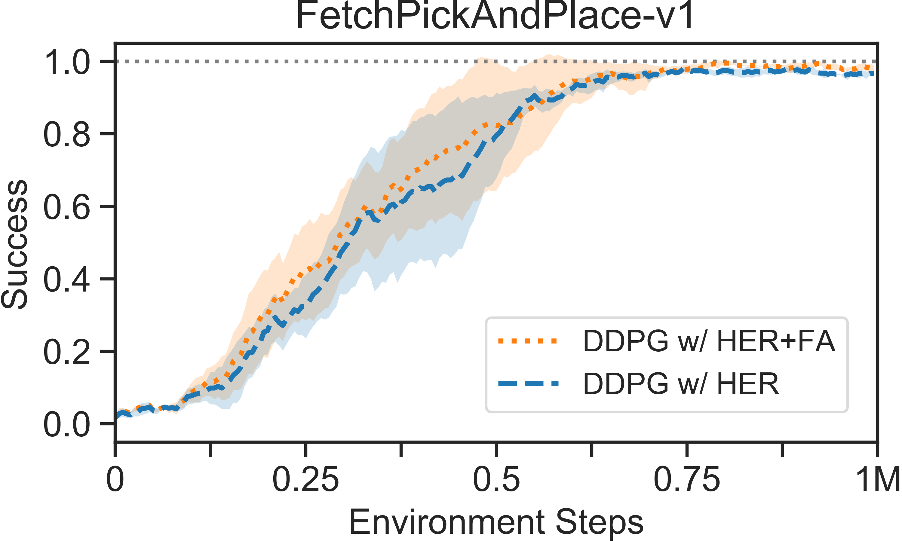

# HER

## Code TODO

- [ ] Drop out
- [ ] Attention/GAT Model
- [ ] D4PG
- [ ] Auto Curriculum
- [ ] Wandb
- [x] Optimize every step? Try to collect more, update with more.
  - not helpful
- [ ] save online HER buffer sample time
- [ ] save get batch times (use for to get items is very slow)

## Experinment TODO

- [x] Update Interval
  
- [x] Update Barch Size
  
  
  
  
## Update Study

### Larger Intervals

| Step                                                         | Time                                                         |
| ------------------------------------------------------------ | ------------------------------------------------------------ |
|  |  |
| Freqent update performs better and not hurt running time.    |                                                              |

### Large Batch

| Steps                                                        | Time                                                         |
| ------------------------------------------------------------ | ------------------------------------------------------------ |
|  |  |
| Current Problems: cannot use the GPU to full                 | 1M batch fail to train<br />100k batch training is slow<br />10k batch takes less times<br /> |

| Batch Size=1k                                                | Batch Size=10k                                               | Batch size=10k + Multi buffer worker                         |
| ------------------------------------------------------------ | ------------------------------------------------------------ | ------------------------------------------------------------ |
|  |  |  |
|                                                              |  |                                                              |
|                                                              | <br />sample data still takes much time as queue.get is slow |                                                              |
|                                                              | <br />1. add subproc to sample data (~10%)<br />2. Boost normalier clip (~2%) |                                                              |
|                                                              | <br />1. Async env |                                                              |

### More Env

| 2 env                                                        | 8 env                                                        | 16 env                                                       | 32 env                                                       |
| ------------------------------------------------------------ | ------------------------------------------------------------ | ------------------------------------------------------------ | ------------------------------------------------------------ |
|  |  |  |  |
| Speedx1                                                      | Speed x1.64                                                  | Speedx2.1                                                    | Speedx2.1                                                    |
| Env/up = 2                                                   | Env/up = 1                                                   | Env/up=0.7                                                   | Env/up = 0.7                                                 |


### Buffer Sample Study

```
*** buffer_state use 0.5850791931152344                                                                                             │·······
buffer_action use 0.30612945556640625                                                                                           │·······
buffer_reward use 0.11014938354492188                                                                                           │·······
*** buffer_next_state use 0.5972385406494141                                                                                        │·······
buffer_done use 0.10967254638671875                                                                                             │·······
buffer_previous_ag use 0.2872943878173828                                                                                       │·······
buffer_ag use 0.2791881561279297                                                                                                │·······
(ignore) buffer_bg use 0.28228759765625                                                                                                  │·······
(ignore) buffer_dg use 0.28395652770996094 
```

1. make a unified buffer, get other information latter
2. make subprocess to sample data in advance

## Tricks

1. clip target network

## Baselines

### Fetch



```shell
PYTHONPATH=./ python experiments/benchmarks/train_her.py --env FetchPickAndPlace-v1 --num_envs 8 --parent_folder ./results --her future_4
```

* other configs

```python
# training
  config.gamma = 0.98
  config.actor_lr = 1e-3
  config.critic_lr = 1e-3
  config.actor_weight_decay = 0.
  config.action_l2_regularization = 1e-2
  config.target_network_update_freq = 10
  config.target_network_update_frac = 0.05
  config.optimize_every = 2 # num_updates/step
  config.batch_size = 1000
  config.warm_up = 5000 # steps wait to update
  config.initial_explore = 10000 # random explore steps
  config.action_noise = 0.1
  config.eexplore = 0.2 # total random action rate (epsilon-greedy)
  config.go_eexplore = 0.1 # for curiosity
  config.go_reset_percent = 0. # for curiosity
  config.grad_value_clipping = -1
  config.her = 'futureactual_2_2' # future-actual-achieved-behavior
  config.replay_size = int(2.5e6)
  config.activ = 'relu'
```